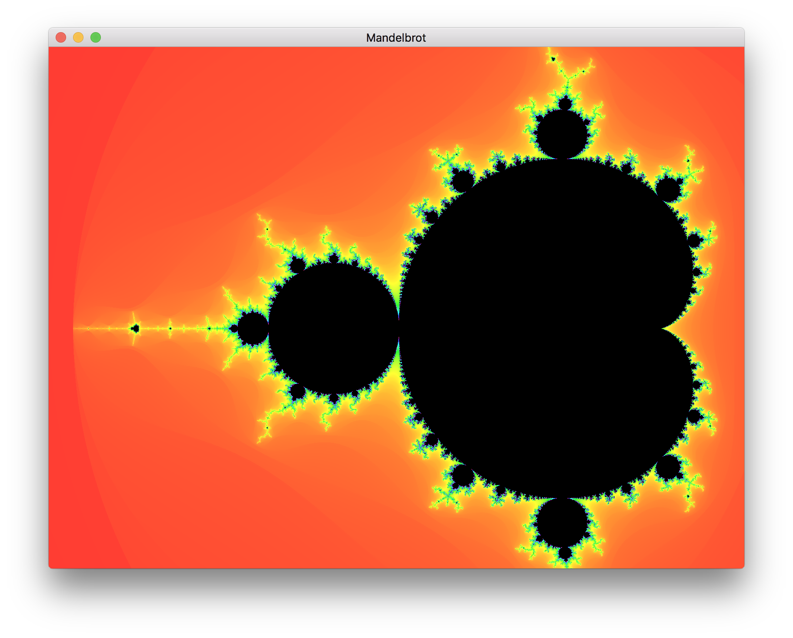
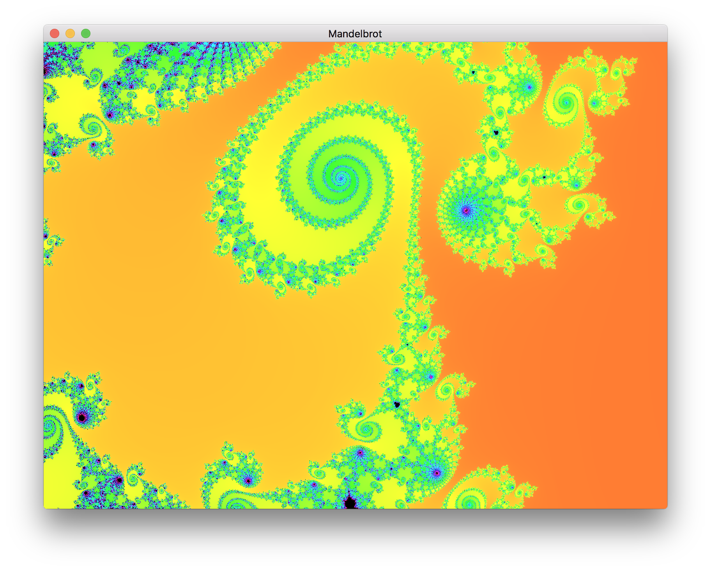

Overview
========

Mandelbrot fractal with navigation and zoom.  Implemented using GLSL and PyOpenGL.

Installation
============

Run command:

 `pip install -r requirements.txt`
 
Examples
========

